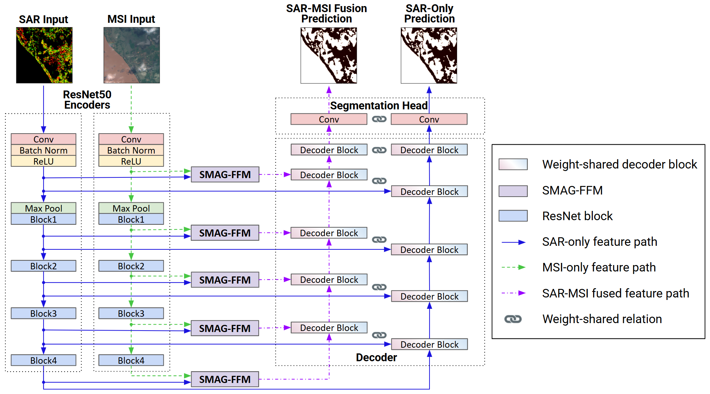

# SMAGNet
 

This an official Pytorch implementation of our paper **"A Spatially Masked Adaptive Gated Network for Multimodal Post-Flood Water Extent Mapping using SAR and Incomplete Multispectral Data"**. The specific details of the proposed model are as follows.

**Abstract:** We propose SMAGNet, a multimodal deep learning model for post-flood water extent mapping that adaptively fuses SAR with incomplete MSI data. Addressing the challenge of missing pixels in optical imagery due to limited temporal resolution and coregistration process, SMAGNet achieves state-of-the-art performance in terms of IoU with a score of 86.47% on the C2S-MS Floods dataset. Furthermore, it demonstrates strong robustness by maintaining high accuracy even when MSI data is completely unavailable, which makes it highly practical for real-world disaster response. 

<p align="center">
  
</p>

## 📢 News
* **2025.12.11**: Source code and trained model checkpoints released.

## ⚙️ Requirements

This project is entirely written in Python, primarily using the PyTorch library. All required dependencies can be installed using:

```sh
# Create a virtual environment
conda env create -f environment.yaml

# Activate the environment
conda activate smagnet
```

## 💾 Datasets

### ⭐ Cloud to Street - Microsoft (C2S-MS) Floods Dataset 
- Download: [https://registry.opendata.aws/c2smsfloods/](https://registry.opendata.aws/c2smsfloods/)
- After downloading the dataset, matching Sentinel-1 and Sentinel-2 patches using metadata, along with preprocessing, is required.

## 🤖 Trained Models

We provide the trained model for quick reproduction. [download](https://drive.google.com/drive/folders/1ZK5xopoaTFv5ROVsy3tHhsp3M61gs42M?usp=drive_link).

Qualitative examples using these trained models are presented in `examples.ipynb`.

## 📊 Results
Comparison with state-of-the-art methods on the C2S-MS Floods dataset:

| Model | IoU (%) | Precision (%) | Recall (%) | OA (%) |
| :--- | :---: | :---: | :---: | :---: |
| U-Net (SAR) | 79.65 (±0.96) | 90.81 (±0.83) | 86.64 (±1.03) | 96.52 (±0.18) |
| PSPNet | 82.65 (±0.85) | 90.83 (±0.93) | 90.19 (±1.29) | 97.02 (±0.15) |
| VFuseNet | 83.33 (±1.00) | 92.98 (±0.62) | 88.92 (±0.89) | 97.20 (±0.18) |
| FuseNet | 83.40 (±1.13) | 92.95 (±0.71) | 89.03 (±0.87) | 97.21 (±0.20) |
| FTransUNet | 83.93 (±2.64) | 92.19 (±1.08) | 90.34 (±2.46) | 97.28 (±0.47) |
| FPN | 84.25 (±0.96) | 91.10 (±1.03) | 91.80 (±0.54) | 97.30 (±0.19) |
| U-Net++ | 84.41 (±1.54) | 92.75 (±0.69) | 90.36 (±1.32) | 97.37 (±0.27) |
| DeepLabV3+ | 84.48 (±1.19) | 92.04 (±0.68) | 91.14 (±1.26) | 97.37 (±0.21) |
| CMGFNet | 84.70 (±0.59) | **94.85 (±0.46)** | 88.78 (±0.71) | 97.48 (±0.10) |
| CMFNet | 84.95 (±0.87) | 92.31 (±0.93) | 91.43 (±0.95) | 97.45 (±0.16) |
| U-Net | 84.96 (±0.97) | 92.88 (±0.60) | 90.88 (±0.92) | 97.47 (±0.17) |
| MCANet | 85.48 (±0.99) | 92.47 (±0.78) | 91.87 (±0.82) | 97.54 (±0.18) |
| MFGFUNet | 85.96 (±0.57) | 92.84 (±0.98) | 92.07 (±0.73) | 97.63 (±0.11) |
| SMAGNet (Ours) | **86.47 (±0.61)** | 93.05 (±0.76) | **92.45 (±0.83)** | **97.73 (±0.11)** |

## 📚 Citation
Will be updated
